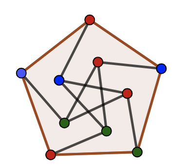

*************************
Reoptimization Algorithms
*************************

Package implementing some well known Reoptimization algorithms

`Perterson Graph <https://en.wikipedia.org/wiki/Generalized_Petersen_grapht>`_ (Made using `GeoGebra <https://www.geogebra.org/?lang=en>`_)

.. contents:: **Table of contents**

============
Introduction
============
Currently, considerable efforts must be put to find optimal solution for NP-Hard problems.
Reoptimisation deals with, If given an optimal solution to a problem instance I\ :sub:`O`,
can we find a good approximated solution to instance I\ :sub:`N`, where I\ :sub:`N` is I\ :sub:`O` with some 'local' modifications?
The goal in this repository is to expose some well known reoptimization algorithms.

=====
Setup
=====

Requirements
~~~~~~~~~~~~

* Python versions: >=3.6, <=3.8

Installation
~~~~~~~~~~~~

* Option 1

  To Install the stable latest package from pypi host

    ``pip install reoptimization-algorithms``

* Option 2

  To install directly from this repository execute the following in repository root directory

    ``python setup.py install``

=============
Documentation
=============

For documentation and usage refer `here <https://mek97.github.io/reoptimization-algorithms/index.html>`_

==============
Implementation
==============

Implementation basically consists of

#. Having a graph data structure utility
#. Implementing the graph algorithms

Algorithms
~~~~~~~~~~

Algorithms implemented

* PTAS for Reoptimization of unweighted k-path vertex cover under constant size graph insertion

============
Contribution
============

Want to add or improvise the repository? Check out the `Contributing <https://github.com/mek97/repotimization-algorithms/blob/release-v0/CONTRIBUTING.rst>`_ documentation :)
